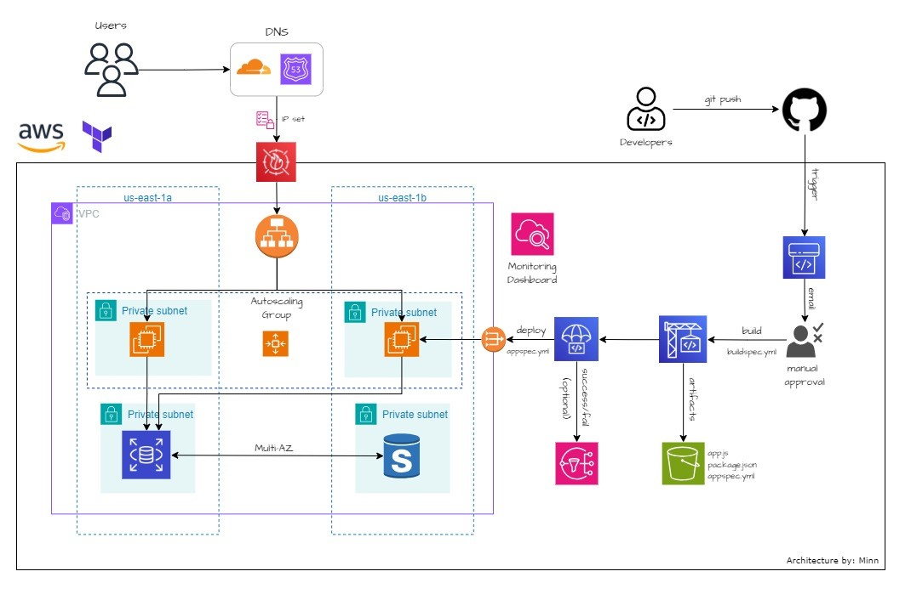

# Deploying Secure and Robust application on AWS

> [!CAUTION]
> This mini project simulates an environment and its architecture might lack some best practices. It is advised against using it for production environments. 

## Prerequisites
- AWS account (<a href="https://aws.amazon.com/free">Create one</a>)
- Valid domain
- Terraform cli setup with admin privileges (<a href="https://developer.hashicorp.com/terraform/tutorials/aws-get-started/install-cli">tf setup</a>)
- AWS cli in us-east-1 with admin privileges (<a href="https://docs.aws.amazon.com/cli/latest/userguide/getting-started-install.html">aws setup</a>)
- Fundamental knowledge of IaC, Git, DNS, and AWS

## Architecture Overview 

## Project Hierarchy

- `/terraform` - terraform configuration files
- `/terraform/modules` - terraform modules for the infrastructure 
- Application repo <a href="https://github.com/YU88John/nodeapp">link</a>

## Technologies 

### AWS
AWS (also known as Amazon Web Services) is the largest Cloud Service Provider in the market. It offers a wide range of services including Data Analytics, Machine learning, and so on. Read more about AWS on their <a href="https://aws.amazon.com/what-is-aws/">website</a>

### Terraform
We will be provisioning the majority of our infrastructure using Terraform. Terraform is an Infrastructure-as-Code tool that we can use to deploy our infrastructure in a repeatable and version-controlled way. There is an AWS-native IaC tool called CloudFormation, but we will be using Terraform in this project due to its agnosticity  across multiple CSPs. Refer to the <a href="https://developer.hashicorp.com/terraform/intro">Terraform documentation</a>.

### Node.js
On the infrastructure that we created, we will deploy a simple 'Hello World' Node.js application. <a href="https://nodejs.org/en/about">About Node.js</a>.

### CloudFlare
For the DNS service, we will be using CloudFlare in conjunction with AWS Route 53. <a href="https://www.cloudflare.com/learning/what-is-cloudflare/">What is CloudFlare?</a>

## Documentation
I have written a Medium article about this project. You can read the article <a href="https://medium.com/@mtkforstudy.john86/ci-cd-on-aws-using-iac-with-a-spice-of-security-745b97c9b385">here</a> and make sure to give claps if you find it useful.